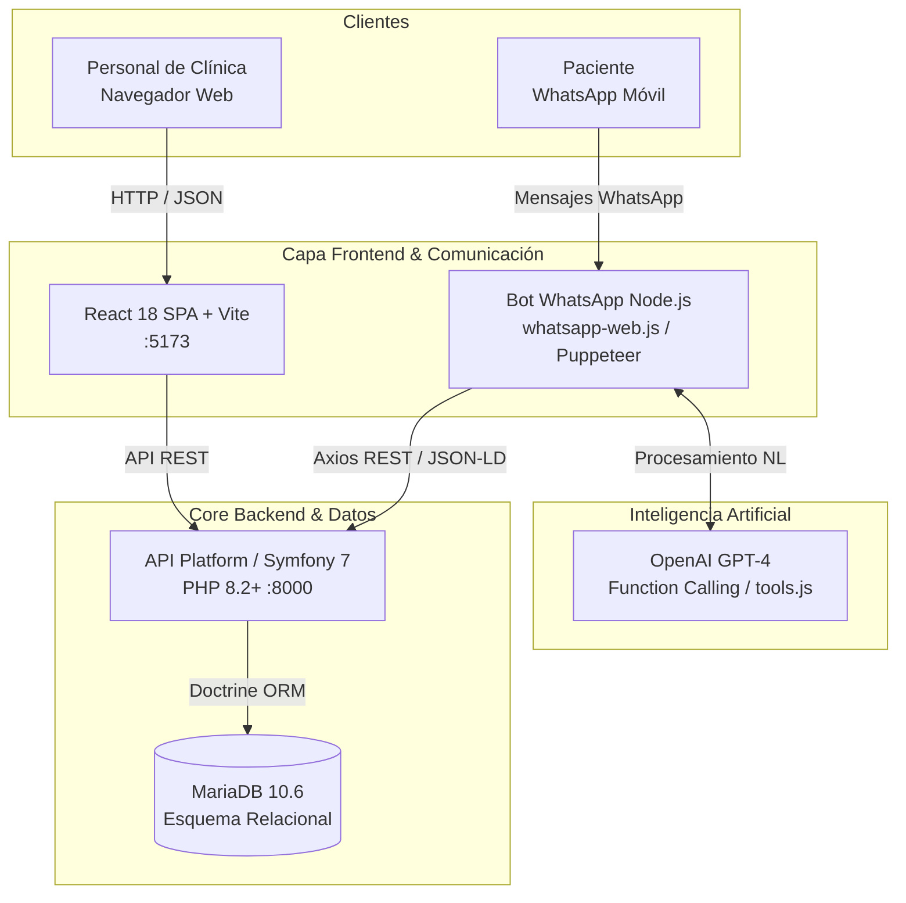

# 🏥 MediBot Dental OS — Dental & Medical Clinic Management System

<div align="center">

  

  <p align="center">
    <b>Plataforma integral de gestión clínica con agenda médica inteligente y recepción automatizada mediante un bot de WhatsApp con IA.</b>
  </p>

  <p align="center">
    <a href="https://php.net"></a>
    <a href="https://symfony.com"></a>
    <a href="https://api-platform.com"></a>
    <a href="https://react.dev"></a>
    <a href="https://mariadb.org"></a>
    <a href="https://docker.com"></a>
    <a href="https://nodejs.org"></a>
    <a href="https://openai.com"></a>
  </p>

</div>

---

## 📖 Resumen

**MediBot Dental OS** es un ecosistema de gestión clínica desarrollado como **Proyecto de Fin de Grado (TFG)** para el ciclo formativo de **Desarrollo de Aplicaciones Web (DAW)**. 

El sistema digitaliza el ciclo operativo de un centro médico u odontológico resolviendo dos necesidades clave: una aplicación web completa para el personal sanitario y un bot interactivo de WhatsApp que permite a los pacientes consultar disponibilidad y agendar citas en lenguaje natural las 24 horas.

### Componentes del Sistema:
1. **Frontend SPA reactivo** en **React 18**, Vite y Tailwind CSS, diseñado para el personal médico y de recepción.
2. **Backend API RESTful robusto** en **Symfony 7** con **API Platform** y Doctrine ORM.
3. **Bot de WhatsApp con IA en Node.js**, utilizando `whatsapp-web.js` (Puppeteer) para la sesión de mensajería y la API de **OpenAI (GPT-4 con Function Calling)** para procesar solicitudes y consultar/escribir directamente contra los endpoints del backend.
4. **Despliegue unificado con Docker Compose**, permitiendo levantar la infraestructura completa (frontend, backend, base de datos MariaDB, phpMyAdmin y el bot) con un único comando.

---

## 💡 Nota de Desarrollo y Decisiones de Arquitectura

> **De prototipo No-Code a Microservicio Pro-Code:**  
> La idea inicial del proyecto contemplaba orquestar el bot de WhatsApp a través de flujos en n8n. Sin embargo, debido a limitaciones de estabilidad en la persistencia de sesión durante el ciclo de desarrollo, se tomó la decisión técnica de **pivotar a una integración directa mediante un microservicio en Node.js**.  
> 
> Esta arquitectura pro-code permitió integrar directamente `whatsapp-web.js` con las herramientas de *Function Calling* de OpenAI y llamadas HTTP estructuradas (Axios) contra la API de Symfony, logrando un entorno 100% estable, predecible y listo para producción y defensa del TFG.

---

## 🏛️ Arquitectura del Sistema



---

## ✨ Módulos y Funcionalidades

- **📅 Agenda Médica Inteligente:** Gestión visual de citas con cálculo de disponibilidad en tiempo real por facultativo y franja horaria, con validación matemática para evitar solapamientos.
- **🤖 Recepcionista Virtual IA (WhatsApp):** Chatbot autónomo que atiende pacientes en lenguaje natural, resuelve dudas frecuentes, consulta huecos disponibles en la agenda y confirma citas directamente en la base de datos.
- **👥 Gestión de Pacientes:** Fichas clínicas digitales detalladas con datos personales, historial de consultas previas y trazabilidad de citas.
- **💳 Facturación y Stock:** Módulos complementarios para el control de cobros, emisión de comprobantes y gestión del inventario de material clínico.
- **🦷 Odontograma Digital:** Interfaz interactiva para el registro visual del estado de las piezas dentales según la nomenclatura internacional.

---

## 📸 Demostración Visual

### 1. Panel de Control y Métricas Clínicas
<div align="center">
  
</div>

<br/>

### 2. Agenda y Calendario de Citas
<div align="center">
  
</div>

<br/>

### 3. Recepcionista Virtual en WhatsApp
<div align="center">
  
</div>

<br/>

### 4. Documentación OpenAPI / API Platform
<div align="center">
  
</div>

---

## 💻 Stack Tecnológico

| Capa | Tecnología | Descripción |
| :--- | :--- | :--- |
| **Frontend** | React 18, Vite, Tailwind CSS | SPA reactiva con componentes modulares y diseño responsive. |
| **Backend** | PHP 8.2+, Symfony 7, API Platform | Arquitectura RESTful estricta con serialización JSON-LD / Hydra. |
| **ORM & BBDD** | Doctrine ORM, MariaDB 10.6 | Modelo relacional optimizado con índices de búsqueda rápida. |
| **Bot WhatsApp** | Node.js, `whatsapp-web.js` (Puppeteer) | Microservicio de mensajería con autenticación local persistente (`LocalAuth`). |
| **IA / LLM** | OpenAI API (GPT-4 con Tools / Function Calling) | Extracción de entidades y ejecución de funciones de backend. |
| **Contenedores** | Docker, Docker Compose | Orquestación multi-servicio para desarrollo y despliegue rápido. |

---

## 🚀 Instalación y Puesta en Marcha

### Prerrequisitos
- [Docker Desktop](https://www.docker.com/products/docker-desktop/) instalado y en ejecución.
- [Node.js](https://nodejs.org/) (versión 18+ recomendada) para el microservicio del bot.
- Clave de API de OpenAI (`OPENAI_API_KEY`).

### Pasos de ejecución

```bash
# 1. Clonar el repositorio
git clone git@github.com:pablocorrea1404-wq/medibot-proyecto-final.git
cd medibot-proyecto-final

# 2. Configurar variables de entorno
cp backend/.env.example backend/.env
cp frontend/.env.example frontend/.env
cp whatsapp-bot/.env.example whatsapp-bot/.env

# (Añadir tu OPENAI_API_KEY en whatsapp-bot/.env)

# 3. Levantar los contenedores de backend, frontend y base de datos
docker-compose up -d --build

# 4. Iniciar el microservicio del bot de WhatsApp
cd whatsapp-bot
npm install
npm run dev
```

*Una vez iniciado el bot, aparecerá un código QR en la terminal para vincular el número de WhatsApp de la clínica.*

---

## 👤 Autor y Contacto

**Pablo Correa Ribeiro**  
*Técnico Superior en Desarrollo de Aplicaciones Web (DAW)*

- 💼 **LinkedIn:** [pablo-correa-ribeiro-2462552a9](https://www.linkedin.com/in/pablo-correa-ribeiro-2462552a9/)
- 💻 **GitHub:** [@pablocorrea1404-wq](https://github.com/pablocorrea1404-wq)
- 📧 **Email:** [pablocorrea1404@gmail.com](mailto:pablocorrea1404@gmail.com)
