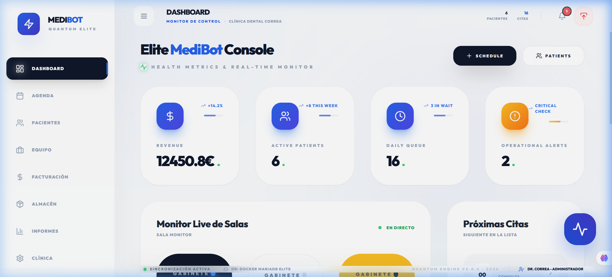
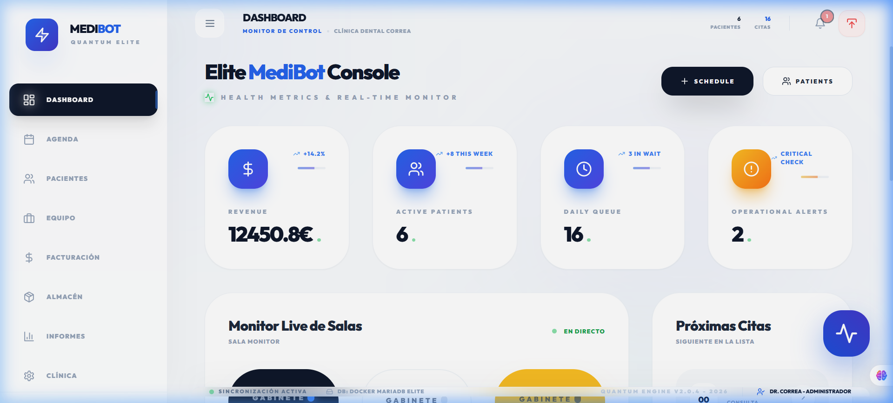
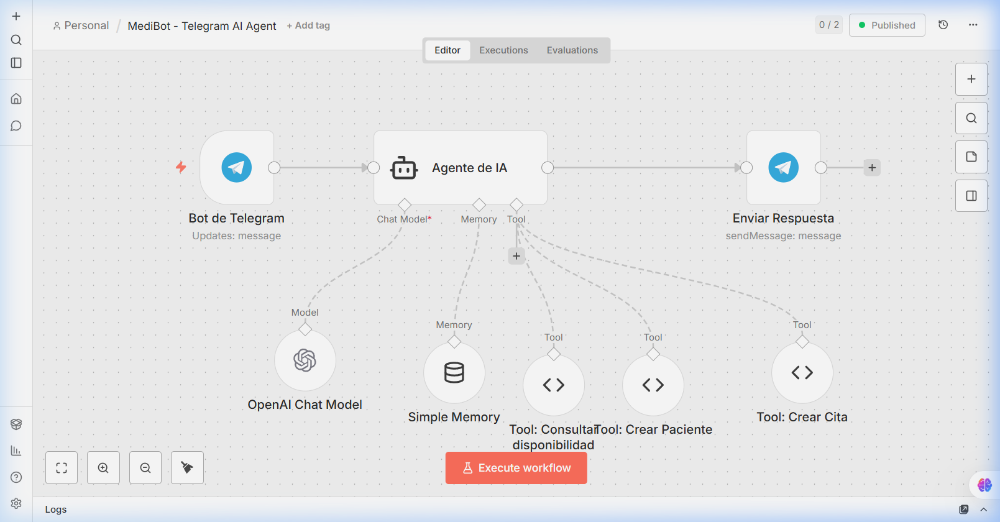
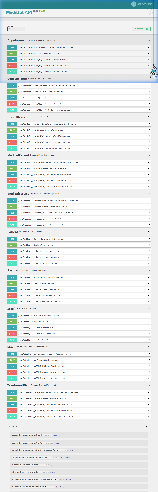
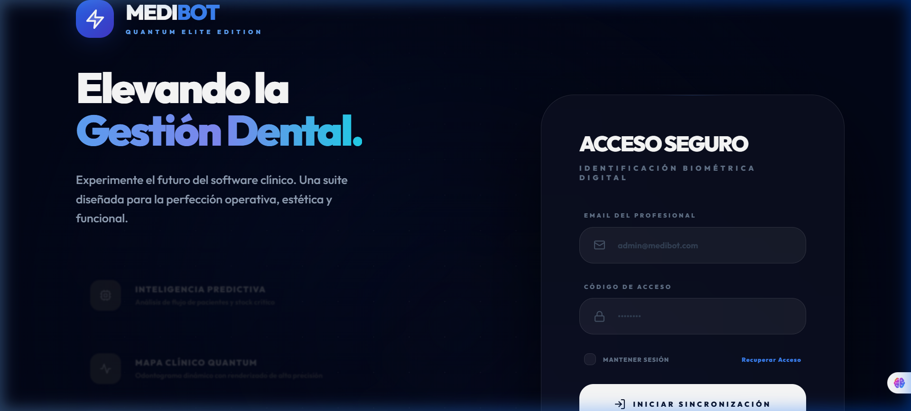
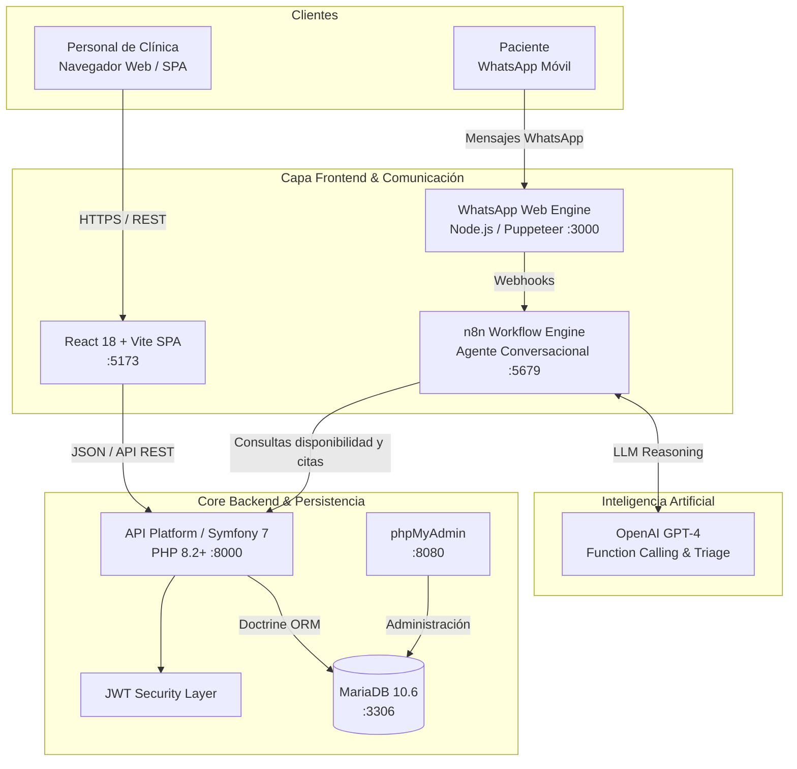

# 🏥 MediBot Dental OS — Dental & Medical Clinic Management System

<div align="center">

  

  <p align="center">
    <b>Plataforma integral de gestión clínica, agenda médica inteligente y recepción automatizada con Inteligencia Artificial vía WhatsApp.</b>
  </p>

  <p align="center">
    <a href="https://php.net"></a>
    <a href="https://symfony.com"></a>
    <a href="https://api-platform.com"></a>
    <a href="https://react.dev"></a>
    <a href="https://mariadb.org"></a>
    <a href="https://docker.com"></a>
    <a href="https://n8n.io"></a>
    <a href="https://openai.com"></a>
  </p>

  <p align="center">
    <a href="#-demostración-visual-y-capturas">Demostración Visual</a> •
    <a href="#-arquitectura-del-sistema">Arquitectura</a> •
    <a href="#-módulos-y-funcionalidades">Funcionalidades</a> •
    <a href="#-stack-tecnológico">Tecnologías</a> •
    <a href="#-instalación-y-puesta-en-marcha">Instalación</a> •
    <a href="#-documentación-de-la-api">API REST</a> •
    <a href="#-autor-y-contacto">Contacto</a>
  </p>

</div>

---

## 📖 Resumen Ejecutivo

**MediBot Dental OS** es un ecosistema de software clínico de nivel empresarial diseñado para modernizar y digitalizar el ciclo operativo completo de centros de salud y clínicas odontológicas. 

El proyecto resuelve la dispersión de datos, los cuellos de botella en la recepción telefónica y la fricción en el agendamiento mediante una arquitectura desacoplada:
1. **Frontend SPA reactivo** en React 18 con Vite y Tailwind CSS para el personal sanitario y administrativo.
2. **Backend API RESTful robusto** en Symfony 7 con API Platform, validaciones estrictas y Doctrine ORM.
3. **Agente autónomo de Inteligencia Artificial para WhatsApp** orquestado con **n8n** y **OpenAI**, capaz de dialogar en lenguaje natural, verificar disponibilidad en tiempo real y agendar citas directamente en la base de datos 24/7.
4. **Despliegue unificado y reproducible** mediante contenedores Docker y Docker Compose.

> Desarrollado como **Proyecto de Fin de Grado (TFG)** para el ciclo formativo de grado superior en **Desarrollo de Aplicaciones Web (DAW)**, con memoria técnica integral y rigor de producción.

---

## 📸 Demostración Visual y Capturas

### 1. Panel de Control y Métricas Clínicas (Dashboard)
Visión global en tiempo real: citas del día, pacientes activos, rendimiento económico y accesos directos de triage.
<div align="center">
  
</div>

<br/>

### 2. Agenda Médica Interactiva y Calendario
Gestión dinámica de turnos, filtrado por especialista médico, selección de franja horaria y prevención automática de colisiones.
<div align="center">
  
</div>

<br/>

### 3. Recepcionista Virtual IA en WhatsApp
Interacción real en lenguaje natural con pacientes: resuelve dudas, consulta la base de datos clínica y confirma citas sin intervención humana.
<div align="center">
  
</div>

<br/>

### 4. API Platform & Swagger UI Interactivo
Documentación viva y estandarizada bajo especificación OpenAPI / JSON-LD, lista para integraciones externas y pruebas en vivo.
<div align="center">
  
</div>

<br/>

### 5. Portal de Acceso Seguro
Autenticación robusta basada en JWT y control de accesos por roles (Administrador, Facultativo, Personal de Recepción).
<div align="center">
  
</div>

---

## 🏛️ Arquitectura del Sistema

El sistema implementa una arquitectura orientada a servicios desacoplados y contenerizados con Docker:



---

## ✨ Módulos y Funcionalidades

### 🦷 1. Odontograma Digital Interactivo
- Representación gráfica de la dentición humana según la **nomenclatura FDI** (arcada superior e inferior, cuadrantes 1 a 4).
- Registro visual del estado de cada pieza: *sana, obturación/empaste, caries, corona, endodoncia, prótesis o extracción*.
- Histórico de intervenciones por pieza dental vinculado directamente a la historia del paciente.

### 📅 2. Motor de Disponibilidad y Agenda Médica
- Controlador optimizado (`AvailabilityController`) que computa huecos libres considerando la jornada laboral del especialista, duración del servicio y citas concurrentes.
- Vistas por día, semana, mes y agenda por doctor.
- Cambio de estados de cita: *Pendiente, Confirmada, En Espera, Realizada, Cancelada*.

### 🤖 3. Asistente Autónomo WhatsApp & IA
- Orquestación mediante flujos de **n8n** con agentes de decisión y herramientas (tool calling).
- Identificación automática de pacientes recurrentes por número de teléfono.
- Alta exprés de pacientes nuevos y reserva directa garantizando no-solapamiento.

### 📁 4. Historia Clínica Electrónica (EHR) y Documentación
- Ficha unificada: datos de filiación, antecedentes médicos, patologías sistémicas y alergias.
- Generación de **Planes de Tratamiento** por fases y presupuestos detallados.
- **Consentimientos Informados Digitales** y generador de **Recetas Médicas**.

### 💳 5. Facturación y Finanzas
- Registro de pagos asociados a citas y tratamientos con balance de cobros pendientes.
- Exportación contable en formato CSV con codificación UTF-8 BOM (`EarningsController`).
- Métricas de facturación por período y profesional.

### 📦 6. Inventario y Control de Stock
- Catálogo de insumos odontológicos (anestesia, composites, fresas, guantes, material de sutura).
- Alertas visuales de stock mínimo y control de consumo por procedimiento.

### 🔒 7. Seguridad y Cumplimiento Normativo (RGPD)
- Tratamiento estricto de datos de salud conforme al **RGPD** y **LOPD-GDD**.
- Contraseñas hasheadas con algoritmos modernos (`Argon2id` / `Bcrypt`).
- Tokens JWT con caducidad para peticiones seguras a la API.

---

## 💻 Stack Tecnológico

| Capa | Tecnología | Versión | Uso Principal |
|---|---|---|---|
| **Frontend** | React | 18.3 | Interfaz de usuario Single Page Application (SPA) |
| **Tooling UI** | Vite | 5.3 | Bundler ultra rápido y servidor de desarrollo HMR |
| **Estilos** | Tailwind CSS | 3.4 | Diseño responsivo, tema clínico y componentes modernos |
| **Iconografía** | Lucide React | 0.344 | Iconos SVG optimizados |
| **Backend** | PHP | 8.2+ | Lenguaje servidor tipado con atributos nativos |
| **Framework** | Symfony | 7.0 | Núcleo backend, inyección de dependencias, seguridad y rutas |
| **API Engine** | API Platform | 3.x | Generación automática de especificaciones OpenAPI y REST |
| **ORM** | Doctrine ORM | 3.x | Mapeo objeto-relacional y migraciones de base de datos |
| **Base de Datos** | MariaDB | 10.6 | Motor relacional de alto rendimiento |
| **Automatización** | n8n | Latest | Orquestación de flujos de eventos y webhooks |
| **Inteligencia Artificial** | OpenAI GPT-4 | API | Comprensión del lenguaje natural y triage asistido |
| **Integración WhatsApp** | WhatsApp-Web.js / Puppeteer | Latest | Puente de comunicación para mensajería instantánea |
| **Contenedores** | Docker & Docker Compose | v2+ | Aislamiento, despliegue y orquestación multi-servicio |

---

## 🚀 Instalación y Puesta en Marcha

Gracias a la contenedorización con **Docker Compose**, todo el ecosistema (Frontend, Backend, Base de Datos, phpMyAdmin y n8n) se despliega con un solo comando.

### Requisitos Previos
- [Docker Desktop](https://www.docker.com/products/docker-desktop/) (con Docker Compose v2) instalado y activo.
- [Git](https://git-scm.com/) instalado.

### 1. Clonar el Repositorio
```bash
git clone git@github.com:pablocorrea1404-wq/medibot-proyecto-final.git
cd medibot-proyecto-final
```

### 2. Configurar Variables de Entorno
Copia los archivos de ejemplo en cada servicio (los valores por defecto funcionan en local):
```bash
# Backend
cp backend/.env.example backend/.env

# Frontend
cp frontend/.env.example frontend/.env

# WhatsApp Bot (si se va a utilizar el bot)
cp whatsapp-bot/.env.example whatsapp-bot/.env
```

### 3. Levantar los Contenedores
```bash
docker-compose up -d --build
```
*Espera unos 30-45 segundos a que todos los contenedores inicialicen.*

### 4. Cargar Datos de Prueba (Fixtures)
Para poblar automáticamente la base de datos con doctores, pacientes, citas y stock clínico:
```bash
docker-compose exec backend php bin/console app:load-fixtures
```

---

## 🌐 URLs de Acceso y Servicios Locales

Una vez levantado el entorno con Docker, los servicios quedan disponibles en los siguientes puertos:

| Servicio | URL Local | Credenciales por Defecto |
|---|---|---|
| **Frontend Web (React)** | [http://localhost:5173](http://localhost:5173) | Libre / Registro en portal |
| **Backend REST API / Swagger** | [http://localhost:8000/api](http://localhost:8000/api) | Autenticación Bearer JWT |
| **phpMyAdmin** | [http://localhost:8080](http://localhost:8080) | Servidor: `db` \| Usuario: `user` \| Pass: `password` |
| **n8n Workflow Engine** | [http://localhost:5679](http://localhost:5679) | Registro inicial de administrador |

---

## 🔌 Documentación de la API

La API de MediBot expone operaciones RESTful con soporte para filtrado, ordenación y paginación nativa:

| Método | Endpoint | Descripción |
|---|---|---|
| `GET` / `POST` | `/api/patients` | Listado y registro de pacientes |
| `GET` / `PUT` | `/api/patients/{id}` | Detalle y actualización de ficha de paciente |
| `GET` / `POST` | `/api/appointments` | Consulta y programación de citas médicas |
| `GET` | `/api/availability?date=YYYY-MM-DD&staffId=X` | Cálculo de franjas horarias disponibles |
| `GET` / `POST` | `/api/staff` | Gestión del equipo médico y auxiliares |
| `GET` / `POST` | `/api/medical_services` | Catálogo de tratamientos y tarifas |
| `GET` / `POST` | `/api/treatment_plans` | Planes clínicos y presupuestos presupuestados |
| `GET` / `POST` | `/api/payments` | Control de cobros y transacciones |
| `GET` | `/api/earnings/export` | Exportación CSV de ingresos del día |
| `GET` / `POST` | `/api/stock_items` | Inventario de insumos clínicos |

> **Swagger UI Interactivo:** Accede a `http://localhost:8000/api` para probar todos los endpoints interactivamente desde el navegador.

---

## 📂 Estructura del Proyecto

```text
medibot-proyecto-final/
├── backend/                  # Núcleo API Symfony 7 + API Platform
│   ├── config/               # Rutas, bundles, seguridad y CORS
│   ├── src/
│   │   ├── Command/          # Comandos CLI (app:load-fixtures)
│   │   ├── Controller/       # Controladores custom (Availability, Earnings)
│   │   ├── Entity/           # Entidades Doctrine (Patient, Appointment, Staff...)
│   │   └── Repository/       # Consultas personalizadas
│   ├── Dockerfile            # Imagen PHP 8.2 FPM optimizada
│   └── composer.json         # Dependencias PHP
├── frontend/                 # Aplicación SPA React 18 + Vite
│   ├── src/
│   │   ├── components/       # Componentes modulares (Calendario, Odontograma...)
│   │   ├── App.jsx           # Enrutamiento y vistas principales
│   │   └── index.css         # Configuración y directivas de Tailwind CSS
│   ├── Dockerfile            # Imagen Node para desarrollo y build
│   └── package.json          # Dependencias NPM
├── whatsapp-bot/             # Bot autónomo WhatsApp
│   ├── index.js              # Lógica de conexión WhatsApp Web
│   ├── tools.js              # Herramientas de consulta a la API de MediBot
│   └── package.json          # Dependencias Node.js
├── documentacion_tfg/        # Documentación académica y técnica completa
│   ├── capturas/             # Capturas de pantalla en alta resolución
│   ├── Documentacion separadA/# Capítulos detallados de la memoria
│   └── MediBot_Memoria_Final.html # Memoria técnica maquetada (+80 págs)
├── docker-compose.yml        # Orquestador multi-contenedor
└── README.md                 # Este documento
```

---

## 🎓 Contexto del Proyecto

Este software fue concebido, diseñado y desarrollado como **Proyecto de Fin de Grado (TFG)** para el título de **Técnico Superior en Desarrollo de Aplicaciones Web (DAW)**.

- **Memoria Técnica**: Incluye un análisis exhaustivo del estado del arte, estudio de viabilidad económica, arquitectura de base de datos relacional normalizada y justificación de decisiones tecnológicas.
- **Rigor Profesional**: Implementa estándares de código limpio (PSR-12 en PHP, buenas prácticas de React), tipado estricto y desacoplamiento para facilitar su migración o escalabilidad en la nube.

---

## 👤 Autor y Contacto

**Pablo Correa Ribeiro**  
*Desarrollador Web Full-Stack | Especialista en Symfony, React, Automatización & IA*

- 💼 **LinkedIn:** [linkedin.com/in/pablo-correa-ribeiro-2462552a9](https://www.linkedin.com/in/pablo-correa-ribeiro-2462552a9/)
- 💻 **GitHub:** [@pablocorrea1404-wq](https://github.com/pablocorrea1404-wq)
- 📧 **Email:** [pablocorrea1404@gmail.com](mailto:pablocorrea1404@gmail.com)

---

<div align="center">
  <sub>⭐ Si este proyecto te ha resultado interesante, no dudes en dejar una estrella en el repositorio.</sub>
</div>
