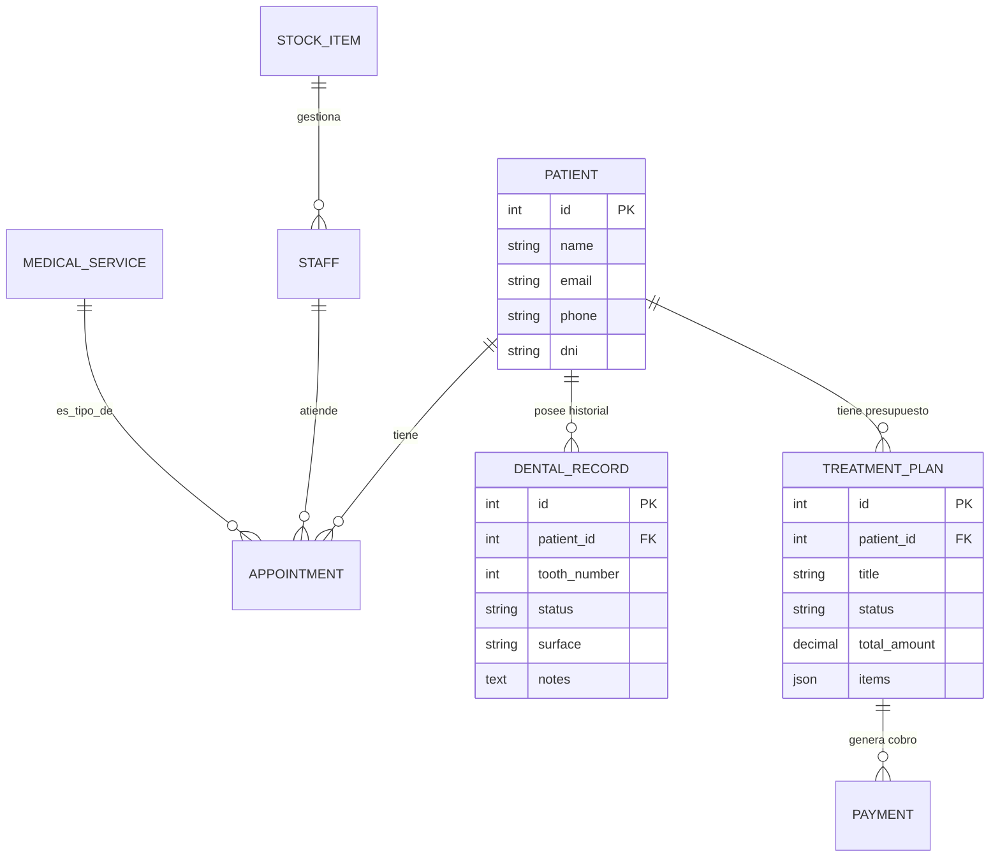

# 📊 Diseño y Estructura de la Base de Datos (Detallado)

## 1. Esquema Conceptual (Diagrama Entidad/Relación)
El sistema MediBot utiliza una base de datos MariaDB estructurada para soportar una gestión clínica integral.

## 2. Listado Detallado de Tablas y Campos

### 🏥 Gestión de Pacientes e Historial
- **`patient`**: Datos básicos (id, name, email, phone, dni).
- **`dental_record`**: Historial por pieza dental.
    - `tooth_number`: Número de diente (1-32).
    - `status`: Estado (caries, empaste, corona, sano, etc.).
    - `surface`: Superficie afectada (mesial, distal, oclusal).
    - `notes`: Observaciones del doctor.
- **`medical_record`**: Antecedentes generales, alergias y medicación crónica.

### 📅 Agenda y Servicios
- **`appointment`**: Registro de citas.
    - `appointment_date`: Fecha y hora.
    - `status`: (pending, confirmed, cancelled, completed).
    - `notes_ia`: Resumen generado automáticamente por GPT-4.
- **`medical_service`**: Catálogo de servicios de la clínica.
    - `name`: Nombre del servicio (Limpieza, Endodoncia).
    - `price`: Precio base.
    - `duration_minutes`: Tiempo estimado de box.

### 💰 Facturación y Presupuestos
- **`treatment_plan`**: Presupuestos entregados al paciente.
    - `status`: (draft, presented, accepted, rejected).
    - `items`: Campo JSON que contiene la lista de tratamientos específicos y su precio.
    - `final_amount`: Total tras aplicar descuentos.
- **`payment`**: Registro de cobros realizados.
    - `amount`: Cantidad abonada.
    - `method`: (cash, card, transfer, insurance).
    - `payment_date`: Fecha del cobro.

### 📦 Logística e Inventario
- **`stock_item`**: Control de almacén.
    - `name`: Producto (Mascarillas, Composite A2).
    - `quantity`: Stock actual.
    - `min_threshold`: Cantidad mínima antes de emitir alerta.
    - `category`: (material, consumible, protección).

## 3. Scripts de Datos (10 Registros por Tabla)
Se ha proporcionado un script SQL completo con inserciones manuales de 10 registros para cada tabla vital, asegurando que el entorno de test esté poblado desde el primer segundo.
Ruta: `backend/database_full_with_data.sql`
